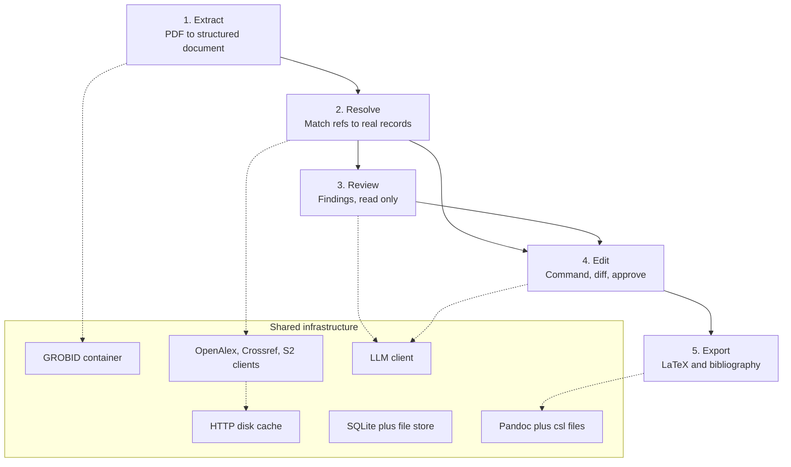
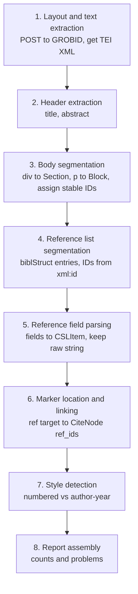

# Paper Improvement Agent: Project Context and Design

Handoff document. Contains the problem, the domain vocabulary, the locked
architectural decisions, the full spec for Stage 1, and lighter sketches for
Stages 2 to 5.

Status: Stage 1 not yet implemented. Stages 2 to 5 deliberately under-designed,
to be specified when reached.

---

## 1. What we are building

A web app for researchers. Upload a paper as PDF, get it checked against real
academic databases, then edit it by typing natural language instructions. The
paper's citations must never silently break.

Three problems it solves, one defense each:

| Problem | Defense |
|---|---|
| Researcher missed relevant work | Search real databases against their claims |
| Researcher cited something that does not say what they think | Fetch the real abstract, compare to the claim |
| AI editing quietly destroys the reference list | Citations as structured nodes, counted before and after every edit |

### User journey

1. **Upload.** Drop in `paper.pdf`. The upload screen is the homepage, not a landing page.
2. **See the parse.** Title, abstract, sections, and all references. Each reference shows whether it was found on OpenAlex or Semantic Scholar. Unresolved and ambiguous ones are shown openly, not hidden.
3. **Request review.** Two kinds of findings: work you should have cited but did not, and citations where the cited source does not actually support the claim. Every finding links to a real paper.
4. **Edit by instruction.** Type "add more citations to the introduction". See a diff. Approve or reject per change.
5. **Export.** Download revised paper as LaTeX plus bibliography, formatted via CSL. Original PDF and every revision remain downloadable.

---

## 2. Domain vocabulary

Needed to read the rest of this document.

**Citation.** A claim plus a pointer to evidence. Has two halves.

**In-text citation** (citation marker). The `[12]` or `(Smith, 2019)` sitting
inside a sentence. Attached to a specific claim.

**Reference** (bibliography entry). The full entry at the end of the paper:
authors, title, venue, year. One reference can be pointed at by many in-text
citations. This is a many-to-one relationship and the data model mirrors it.

**Citation style.** How markers and reference lists are formatted. Two families
matter here:
- Numbered (IEEE): `[12]` in text, references listed in citation order.
- Author-year (APA): `(Vaswani et al., 2017)` in text, references listed alphabetically.

Hundreds of styles exist. Never hand-write formatting code for them.

**CSL** (Citation Style Language). Separates citation data from presentation.
- **CSL-JSON**: a source described as pure data, zero formatting.
- **`.csl` file**: an XML stylesheet that turns CSL-JSON into IEEE, APA, etc. Thousands exist, maintained at the Zotero style repository.
- **citeproc**: a library that combines the two. We use Pandoc's built-in citeproc.

```
CSL-JSON + ieee.csl --citeproc--> [12] A. Vaswani et al., "Attention is..."
CSL-JSON + apa.csl  --citeproc--> Vaswani, A. (2017). Attention is all you need.
```

Example CSL-JSON item:

```json
{
  "id": "ref_12",
  "type": "paper-conference",
  "title": "Attention is All You Need",
  "author": [
    {"family": "Vaswani", "given": "Ashish"},
    {"family": "Shazeer", "given": "Noam"}
  ],
  "container-title": "NeurIPS",
  "issued": {"date-parts": [[2017]]},
  "DOI": "10.48550/arXiv.1706.03762"
}
```

**DOI.** Permanent unique ID for a paper, e.g. `10.1038/nature14539`. A primary
key for academic literature. Used for exact deduplication, since title matching
is unreliable.

**OpenAlex / Semantic Scholar.** Free databases of roughly 250 million papers
each, with titles, authors, abstracts, DOIs, citation graphs. OpenAlex needs no
API key. Semantic Scholar's key is free and optional but unkeyed rate limits are
harsh. Used for two distinct jobs: verifying that parsed references are real (and
getting their abstracts), and discovering papers the author missed.

**Hallucinated citation.** An LLM producing a plausible-looking reference that
does not exist. The single worst possible bug in this product. Prevented
structurally, not by prompting.

---

## 3. Assignment requirements

### Three required capabilities

**1. Upload and parse.** PDF to structured, citation-parsable representation:
title, abstract, sections, all in-text citations, all references parsed into
fields. Requires a documented staged algorithm, explicitly not ad-hoc pattern
matching. Handle more than one citation style. Surface unparseable citations
instead of dropping them.

**2. Peer review, on request.**
- Missing work: papers on Semantic Scholar and OpenAlex the paper should plausibly cite but does not, searched by claim, section, or topic.
- Claim and citation match: pull the cited work's abstract, flag claims the cited source does not support.
- Reviewer-style actionable findings, each grounded in a real linkable source.

**3. Agentic editing in natural language.** Commands like "add more citations to
the introduction", "make the intro shorter". Every edit must keep the paper
intact: existing citations survive, new claims carry real citations, citations
stay attached to the right context when text moves, changes shown for approval,
then export.

### Hard rules

- CSL-JSON is the one canonical citation model. Formatting via `.csl` files through citeproc. No hand-written regex or string templates for citation formatting.
- Only OpenAlex and Semantic Scholar for external lookup. Do not invent sources outside these.
- Surface uncertainty and failure: unparseable citations, empty searches, low-confidence matches. An honest visible limitation beats a fabricated citation.
- LaTeX recommended for export so structure and references survive the round trip.
- First screen is the upload, not a landing page.

### Grading weight, in order

1. **System design.** Writeups on two specific pieces: citation parsing, and the agent. Weighted most heavily.
2. **Code quality.** Clear module boundaries, real data models, tests on core behavior, no single giant prompt doing everything.
3. **User interaction.** A workflow a researcher can drive. Ranked below the first two.

Two non-negotiables that override the ordering:
- Review grounded in real linkable sources, never hallucinated.
- Edits never silently break the paper's citations or structure.

### Explicitly not graded

Visual polish. Perfect support for exotic PDF layouts. A fully automatic editor
that removes the human. Breadth: they want one coherent working slice, not a
broad shallow demo.

### Submission checklist

- [ ] Implementation with short README on how to run
- [ ] System design writeup for citation parsing and the agent
- [ ] Screen recording or screenshots of the workflow on a real paper
- [ ] Note on where AI tools were used and what was verified by hand
- [ ] Known limitations and what would be done with more time

Time budget: roughly 24 hours available.

---

## 4. Architecture: five stages



Stage-by-stage responsibilities:

| Stage | Input | Output | Mutates? |
|---|---|---|---|
| 1. Extract | PDF bytes | Document + raw references + parse report | creates |
| 2. Resolve | raw references | References with DOI, abstract, confidence | creates |
| 3. Review | Document + References | Findings | no |
| 4. Edit | Document + command | Proposal, then new revision on approval | yes, append-only |
| 5. Export | a revision | `.tex` + bibliography | no |

### Why Resolve is its own stage

Extraction produces a **query**. Resolution produces the **truth**.

GROBID gives you the string `"Child et al., Generating long sequences with
sparse transformers, 2019"`. That is a guess. Take it to OpenAlex and Crossref,
search, score the match, and either get a real record with a DOI and abstract, or
flag it unresolved.

This deserves separation because:
- Review depends on it entirely. You cannot check a claim against a source without the source's abstract.
- Edit deduplication depends on it. Knowing "is this suggested paper already cited?" requires DOIs.
- It is where the "surface uncertainty" requirement lives. The resolved / ambiguous / unresolved counts are what the parse screen displays.
- It decouples output quality from parser quality. The authoritative CSL-JSON comes from the matched external record, not from our parser.

### Stages 3 and 4 share machinery

Review and Edit both need literature search, the source pool, and the resolver.
Build that layer once; both call it. When the edit agent searches for a paper to
insert, it goes through the same path review uses to find missing work.

---

## 5. Locked design decisions

These are expensive to change later. Everything else is cheap and can be decided
when reached.

### 5.1 Citations are nodes, never text

The load-bearing decision. A paragraph is not a string. It is a list of inline
nodes:

```python
[
  TextRun("Transformers outperform RNNs on long sequences "),
  CiteNode(ref_ids=["ref_12", "ref_15"]),
  TextRun(", though at higher memory cost."),
]
```

The characters `[12, 15]` do not exist anywhere in stored data. They appear only
at render time.

Consequences:
- An LLM rewriting prose cannot accidentally delete a citation, because citations are not in the prose.
- Citation preservation becomes countable: were there 2 CiteNodes before? Are there 2 after?
- "Never break citations" becomes a checkable system property instead of a prompt instruction.

This is the sentence the design doc leads with.

### 5.2 CSL-JSON is the single canonical citation model

Everything, whether scraped from the user's PDF or fetched from OpenAlex, becomes
CSL-JSON. One shape for all citation data. All formatting comes from `.csl` files
through Pandoc citeproc. Zero string templates.

### 5.3 Documents are immutable, edits create revisions

Every approved edit creates revision N+1 rather than mutating in place.

```
paper_abc/
  original.pdf        never touched
  rev_0.json          the parse, as extracted
  rev_1.json          after "add citations to intro"
  rev_2.json          after "shorten intro"
  library.json        references, append-only
```

Each revision records which command produced it and which changes the user
approved.

Why:
- Undo is pointing at an earlier revision, not reversing an edit.
- The invariant checker already needs base and candidate documents in hand, so immutability is the natural shape.
- It is the strongest answer to the brief's stated anxiety about the user's manuscript being quietly rewritten. Original always downloadable, every step auditable.

The library is append-only too. Once a reference exists it is never deleted, even
if the user rejects the edit that introduced it. That way no revision can point
at a missing reference.

### 5.4 Block IDs are stable

`s2.p3` means section 2, paragraph 3 at parse time. It never changes after that.
A paragraph inserted before it gets a fresh ID, not a renumbering.

The agent addresses blocks by ID, the diff is keyed by ID, and revisions compare
by ID. If IDs were recomputed on render, nothing downstream would work.

### 5.5 Provenance is tracked, and the LLM can only select, never produce

Every reference carries where it came from. Any citation the agent inserts must
point at a reference with `provenance == "fetched_from_api"` and non-empty
`external_ids`. A fabricated citation cannot satisfy that, structurally.

### 5.6 Parsers are pluggable

`ParserBackend.parse(pdf) -> str` returning raw TEI. GROBID is the shipped
implementation. The interface itself is what gets argued in the design doc:
parsing is a pluggable stage, GROBID is the production choice, here is what a
native fallback would need to satisfy.

---

## 6. Stack

| Concern | Choice | Note |
|---|---|---|
| Language | Python 3.11+ | |
| Web framework | FastAPI | typed API docs generated from the Pydantic models |
| Data models | Pydantic v2 | validation at every boundary |
| PDF parsing | GROBID `lfoppiano/grobid:0.8.0` | CRF image, ~300MB, not the 10GB DL image |
| XML | lxml | |
| HTTP | httpx | wrapped in a disk cache |
| Storage | SQLite plus a file directory | one user, one machine, no concurrency story needed |
| Rendering | Pandoc with `--citeproc` | all formatting from `.csl` files |
| Frontend | React plus Vite | four screens, minimal styling |

### docker-compose

```yaml
services:
  grobid:
    image: lfoppiano/grobid:0.8.0
    ports: ["8070:8070"]
    healthcheck:
      test: ["CMD", "curl", "-f", "http://localhost:8070/api/isalive"]

  api:
    build: ./api
    ports: ["8000:8000"]
    environment:
      GROBID_URL: http://grobid:8070
      OPENALEX_MAILTO: ${OPENALEX_MAILTO}
      S2_API_KEY: ${S2_API_KEY:-}
      LLM_API_KEY: ${LLM_API_KEY}
    volumes: ["./data:/data"]
    depends_on:
      grobid:
        condition: service_healthy

  web:
    build: ./web
    ports: ["5173:5173"]
    environment:
      VITE_API_URL: http://localhost:8000
```

---

## 7. Repo layout

```
api/app/
├─ models/               pure Pydantic, zero I/O
│   ├─ csl.py               CSLItem, CSLDate, CSLAuthor
│   ├─ document.py          Document, Section, Block, TextRun, CiteNode
│   ├─ library.py           RawReference, Reference, Resolution
│   ├─ review.py            Claim, Finding, Evidence
│   └─ report.py            ParseReport, ParseProblem
├─ parsing/
│   ├─ backend.py           ParserBackend protocol
│   ├─ grobid.py            GrobidBackend, HTTP only, returns raw TEI
│   ├─ tei.py               TEI to Document plus raw references
│   ├─ citations.py         CiteNode construction and marker linking
│   ├─ style.py             citation style detection
│   └─ report.py            parse report assembly
├─ resolve/                 stage 2, later
│   ├─ cache.py
│   ├─ openalex.py  crossref.py  semantic_scholar.py
│   └─ reconciler.py
├─ agent/                   stages 3 and 4, later
│   ├─ tools.py  review.py  edit.py  invariants.py
├─ render/                  stage 5, later
│   ├─ pandoc_md.py  export.py
├─ store.py
├─ routes/
└─ main.py

api/tests/
├─ fixtures/
│   ├─ numbered.tei.xml       committed, IEEE-style paper
│   └─ author_year.tei.xml    committed, APA-style paper
└─ test_*.py

api/styles/                   ieee.csl, apa.csl, nature.csl
docs/
├─ 01-citation-parsing.md
└─ 02-agent.md
web/
```

`models/` importing nothing but Pydantic is the boundary that makes "clear
module boundaries and data models" self-evident on a skim.

---

## 8. Data models

Target shape. Write these first, before any logic.

```python
# models/document.py

class TextRun(BaseModel):
    kind: Literal["text"] = "text"
    text: str

class CiteNode(BaseModel):
    kind: Literal["cite"] = "cite"
    id: str                        # "c_0041", stable
    ref_ids: list[str]             # ["ref_12", "ref_13"] for grouped markers
    raw_marker: str | None = None  # "[12, 13]" as it appeared, for style detection
    prefix: str | None = None      # "see also"
    locator: str | None = None     # "p. 4"

Inline = TextRun | CiteNode        # discriminated on "kind"

class Block(BaseModel):
    id: str                        # "s2.p3", stable across revisions
    kind: Literal["paragraph", "heading", "abstract", "caption"]
    inlines: list[Inline]

class Section(BaseModel):
    id: str
    title: str
    level: int
    blocks: list[Block]

class Document(BaseModel):
    id: str
    paper_id: str
    revision: int
    title: str
    style: Literal["ieee", "apa", "nature", "unknown"]
    sections: list[Section]
```

```python
# models/library.py

class RawReference(BaseModel):
    """Output of stage 1. Not yet verified against anything."""
    id: str                        # "ref_12", derived from TEI xml:id
    raw: str                       # verbatim string, ALWAYS populated
    parsed: CSLItem | None         # from GROBID fields, may be partial
    parse_quality: Literal["good", "degraded", "failed"]
    problems: list[str] = []       # "no title", "no authors"

class Resolution(BaseModel):
    """Output of stage 2."""
    status: Literal["resolved", "ambiguous", "unresolved"]
    score: float
    matched: CSLItem | None
    external_ids: dict[str, str]   # doi, openalex, s2_corpus_id
    abstract: str | None
    source_api: str | None
    candidates: list[dict] = []    # shown in UI when ambiguous

class Reference(BaseModel):
    id: str
    raw: str
    parsed: CSLItem | None
    resolution: Resolution
    provenance: Literal["parsed_from_pdf", "fetched_from_api"]
    discovered_by: str | None      # tool_call id, for API-sourced refs

    @property
    def csl(self) -> CSLItem:
        """matched record if resolved, else our best parse"""
        ...
```

```python
# models/report.py

class ParseProblem(BaseModel):
    severity: Literal["warning", "error"]
    kind: str          # "unlinked_marker", "reference_no_title", "no_abstract"
    detail: str
    ref_id: str | None = None
    block_id: str | None = None

class ParseReport(BaseModel):
    section_count: int
    block_count: int
    reference_count: int
    references_good: int
    references_degraded: int
    citation_node_count: int
    unlinked_marker_count: int
    detected_style: str
    style_confidence: float
    problems: list[ParseProblem]
```

`ParseReport` is not an afterthought. The brief requires surfacing failure, and
this object is what the parse screen renders.

---

## 9. Stage 1 spec: upload and extract

Scope: PDF in, structured document out. No API calls, no LLM, no resolution.

### 9.1 Three artifacts

**A. Document structure.** Title, abstract, ordered sections, paragraphs, and
citations as nodes inside those paragraphs.

**B. Raw reference list.** Every bibliography entry, verbatim string always
preserved, plus whatever fields parsed out.

**C. Parse report.** Counts and problems, honestly reported.

### 9.2 Components

| Module | Job | Depends on |
|---|---|---|
| `parsing/backend.py` | interface: `parse(pdf_bytes) -> str` returning raw TEI | nothing |
| `parsing/grobid.py` | HTTP call, retries, timeout | httpx |
| `parsing/tei.py` | TEI to Document plus raw references | lxml, models |
| `parsing/citations.py` | build CiteNodes, link markers to references | models |
| `parsing/style.py` | detect numbered vs author-year | nothing |
| `parsing/report.py` | assemble the parse report | models |

`grobid.py` returns a raw string and nothing else. It does not know what a
Document is. That boundary is what makes `tei.py` testable without Docker.

### 9.3 The algorithm, eight explicit steps

This section goes verbatim into `docs/01-citation-parsing.md`.



**Step 1. Layout and text extraction.** POST the PDF to GROBID
`processFulltextDocument` with `consolidateCitations=0` and
`includeRawCitations=1`. That second flag is important: GROBID returns the
verbatim reference string alongside its parsed fields, so the original is kept
even when parsing fails. Output is TEI XML.

**Step 2. Header extraction.** Read `teiHeader` for title,
`profileDesc/abstract` for the abstract. If title is missing, fall back to the
first heading in the body and record a problem.

**Step 3. Body segmentation.** Walk `text/body/div`. Each `div` becomes a
Section, its `head` is the title. Each `p` inside becomes a Block with a stable
ID `s{section_index}.p{para_index}`.

**Step 4. Reference list segmentation.** Read
`back/div[@type='references']/listBibl/biblStruct`. Each `biblStruct` is one
entry; GROBID has already done the splitting. Assign IDs from its `xml:id`
(`b12` becomes `ref_12`) so the marker links stay valid.

**Step 5. Reference field parsing.** For each `biblStruct`, pull authors, title,
container title, year, volume, pages, DOI. Map into a `CSLItem`. Keep `raw` from
`<note type="raw_reference">`. Compute `parse_quality`: `good` if title and at
least one author and a year; `degraded` if title present but fields missing;
`failed` if no title. Never drop an entry.

**Step 6. In-text marker location and linking.** Inside each paragraph GROBID
emits `<ref type="bibr" target="#b12">[12]</ref>`. Walk the paragraph's mixed
content in document order: plain text becomes `TextRun`, each `ref` becomes a
`CiteNode` with `ref_ids` resolved from `target`. Adjacent CiteNodes separated
only by punctuation such as `, ` merge into one node with multiple `ref_ids`, so
`[12], [13]` becomes a single node. A `ref` with no `target` becomes a CiteNode
with empty `ref_ids` and is recorded as an unlinked marker.

**Step 7. Style detection.** Sample `raw_marker` across CiteNodes. Mostly digits
inside brackets means `numbered`. Contains a four-digit year plus letters means
`author-year`. Ambiguous or too few samples means `unknown`, and the user picks
in the UI.

**Step 8. Report assembly.** Count everything from steps 3 to 7, collect
problems, return alongside the document.

Eight steps, each one a function, each one testable in isolation. That is the
answer to "not ad-hoc pattern matching that happens to work on one file".

### 9.4 Decisions worth defending in the writeup

**Why the raw string is always kept.** A reference whose fields failed to parse
is still useful. It can be shown to the user verbatim, and it can still be sent
to a search API as a single query string in stage 2. Dropping it because parsing
failed is exactly what the brief prohibits.

**Why block IDs are positional but frozen.** See 5.4.

**Why GROBID over hand-rolled parsing.** One HTTP call returns section
hierarchy, references parsed into fields, and in-text markers already linked to
reference entries. It is CRF-based and trained on real papers, so multi-style
handling comes free. Hand-rolling means solving reference-block detection, entry
segmentation, field parsing, and marker linking separately, realistically 6 to 8
hours versus 2 to 3, and the result would be the ad-hoc pattern matching the
brief warns against. Cost is a Java container and unfamiliar TEI XML. Mitigated
by the `ParserBackend` interface and committed TEI fixtures.

### 9.5 Failure modes

| Failure | Behavior |
|---|---|
| GROBID unreachable or times out | 502 with clear message, do not half-save |
| No reference section found | Document parses, report says zero references, UI warns loudly |
| `biblStruct` with no title | RawReference with `raw` populated, `parse_quality: failed`, flagged |
| `ref` marker with no target | CiteNode with empty ref_ids, counted as unlinked |
| Scanned PDF, no text layer | GROBID returns near-empty body, report flags suspiciously low text |
| Style undetectable | `style: unknown`, user picks in UI |

### 9.6 API surface

```
POST /papers          multipart pdf  -> {paper_id}
GET  /papers/{id}                    -> {document, references, report}
```

The GET response is exactly what the parse screen renders.

### 9.7 Testing without Docker

Run GROBID once on an arXiv paper, save the TEI to
`tests/fixtures/numbered.tei.xml`, commit it. Do the same with an APA-style
paper as `author_year.tei.xml`. Now `pytest` runs in under a second with no
containers.

- `test_tei_structure`: title and abstract present, section count correct, a known section has expected block count
- `test_reference_extraction`: reference count correct, `ref_12` has expected author surname and year
- `test_citation_linking`: a specific block contains a CiteNode pointing at a known ref_id; a grouped marker produced one node with two ref_ids
- `test_raw_always_present`: every RawReference has non-empty `raw` regardless of parse quality
- `test_degraded_reference_flagged`: a reference missing a title is marked failed, not dropped
- `test_no_brackets_in_textruns`: no TextRun in the document contains a citation marker character sequence
- `test_style_detection_numbered` / `test_style_detection_author_year`: one per fixture

### 9.8 Acceptance criteria

Stage 1 is done when:

1. `docker compose up`, upload an arXiv PDF, get back correct title, correct abstract, sections matching the paper
2. Reference count matches a manual count from the PDF
3. At least one paragraph shows citations as separate nodes, surrounding text intact, no bracket characters anywhere in TextRun strings
4. The report shows non-zero counts and names problems honestly
5. Tests pass with GROBID stopped
6. The eight steps above match what the code actually does

Criterion 3 is the one to verify most carefully. Everything in stages 3 and 4
depends on it being true.

---

## 10. Stages 2 to 5: sketches only

Deliberately light. Design each properly when reached, since prompt wording,
ranking heuristics, and tool surfaces are cheap to change and expensive to
guess at in advance.

### Stage 2: Resolve

For each `RawReference`:
- If DOI present, look it up directly on Crossref then OpenAlex.
- Else search OpenAlex by title. Score candidates on normalized title similarity plus author surname overlap plus year proximity.
- Score above ~0.85 is `resolved`. 0.6 to 0.85 is `ambiguous` with candidates surfaced in the UI. Below is `unresolved`.
- Fetch abstract from OpenAlex; fall back to Semantic Scholar where missing.

A keyed disk cache wrapping every outbound call is not optional. Unkeyed
Semantic Scholar throttles hard, and the same test paper will be parsed dozens
of times during development.

### Stage 3: Review

Three separate small LLM passes, not one big prompt.

**Pass A, claim extraction.** Per section, return claims with `block_id`,
sentence index, claim text, and attached CiteNodes. Claims with zero citations
become candidates for missing work. Claims with citations go to Pass C.

**Pass B, missing work.** For each uncited claim: generate a couple of queries,
hit Semantic Scholar relevance search and OpenAlex search, plus S2
recommendations seeded on the already-resolved reference IDs (cheap and strong
for "work you missed"). Dedupe against the cited set by DOI and OpenAlex ID.
Rerank remaining candidate abstracts against the claim by embedding cosine
similarity, then have the LLM judge only the top few. That reranking step is
what makes this defensible as semantic rather than keyword search, which the
brief calls out by name.

**Pass C, claim and citation match.** For each cited claim whose reference
resolved and has an abstract: the model must quote a span from the abstract
before assigning a grade of `supports | partially_supports | not_supported |
insufficient_evidence`. Empty quote forces `insufficient_evidence`.
Quote-before-label, with a forced default, is the anti-hallucination technique.

Findings carry `block_id`, span, severity, evidence quote, and linkable sources,
which is what lets the UI render them inline.

Sentences are derived at review time by a `sentences(block)` helper returning
spans plus the CiteNodes falling inside each. Not stored, so nothing to keep in
sync.

### Stage 4: Edit

Function calling over a tool surface. The LLM never receives the whole document
as text.

```
read:    get_outline()  read_block(id)  read_section(id)
search:  search_literature(query, limit) -> registers reconciled candidates
         into a session source pool, returns pool ids
write:   rewrite_block(block_id, inlines)
         insert_block(after_block_id, inlines)
         add_citation(block_id, sentence_index, source_id)
         delete_block(block_id)
         finish(summary)
```

Write tools take structured `inlines`, so the model emits CiteNodes explicitly
rather than typing bracket markers into prose.

Every write produces a candidate document that must pass
`invariants.check(base, candidate)`:

1. **Citation preservation.** For every `ref_id`, occurrence count in base must be `<=` count in candidate, unless listed in `approved_removals`.
2. **Real sources only.** Every new `ref_id` exists in the library with `provenance == "fetched_from_api"` and non-empty `external_ids`.
3. **Skeleton intact.** No section vanishes. No block ID reused for different content.
4. **Append-only bibliography.** References are never deleted within a session.

A violation returns a structured error back into the agent loop for retry, up to
2 attempts, then surfaces to the user as a failed edit with the reason. Never
silently applied.

Diff for the UI: render base and candidate blocks to display text with
placeholder markers, word-level `difflib`, per-block accept or reject.

### Stage 5: Export

Document to Pandoc Markdown with `[@ref_12]` keys, bibliography as CSL-JSON,
then:

```bash
pandoc paper.md --citeproc --csl styles/ieee.csl \
       --bibliography refs.json -s -o paper.tex
```

All formatting from the `.csl` file, zero string templates. Ship `.tex` plus
CSL-JSON always. PDF output needs a TeX engine in the image, so it is the first
thing to cut under time pressure.

---

## 11. Build plan

Phase 0 and Phase 1 come before deepening any single stage.

**Phase 0, ~45 min.** Write the Pydantic models in `models/`, no logic. Every
stage's input and output type exists and validates. This is the one-time upfront
design; once locked, later stages can be designed independently because the
interfaces are fixed.

**Phase 1, ~3 hrs. Walking skeleton, end to end, deliberately terrible.** Real
PDF in, LaTeX out, every stage present but hollow:
- Extract: real GROBID call, real TEI parse (do not fake this, surprises live here)
- Resolve: stub returning `unresolved` for everything
- Review: one hardcoded finding
- Edit: one tool that uppercases a block, plus the invariant checker actually working
- Export: real Pandoc call with a real `.csl` file

Rationale: schedule risk is in the integrations, not the logic. GROBID's TEI has
quirks. Pandoc citeproc has quirks. Finding those at hour 3 costs an hour;
finding them at hour 19 costs the submission. Also, after Phase 1 there is
something demoable, so everything after is improvement rather than construction.

**Phase 2.** Deepen one stage at a time in dependency order. For each stage:
think 15 minutes about that stage specifically, build it, then immediately write
its section of the design doc while it is fresh.

### Time budget, ~20 productive hours

| # | Checkpoint | Hrs |
|---|---|---|
| 0 | `models/` complete and validating | 0.75 |
| 1 | Compose up, GROBID alive, TEI fixtures committed | 1 |
| 2 | Walking skeleton end to end | 2.5 |
| 3 | Stage 1 complete, tests passing, `docs/01` written | 2.5 |
| 4 | Stage 2 resolver plus cache | 2 |
| 5 | Review passes A and C | 2.5 |
| 6 | Review pass B, missing work with rerank | 1.5 |
| 7 | Edit tools plus invariant checker | 3 |
| 8 | Export path | 1 |
| 9 | Frontend, four screens | 3.5 |
| 10 | README, `docs/02`, limitations, recording | 2.5 |

Pre-committed cut list, in order, if falling behind:
1. PDF export (ship `.tex` plus CSL-JSON, note as a limitation)
2. Automatic style detection (make the user pick)
3. Embedding-based reranking (fall back to S2 relevance order plus LLM judge)
4. Third CSL style (ship IEEE and APA only)

Never cut: the design docs. They are the top-weighted artifact and must not be
written from memory at hour 23.

### The one test that best demonstrates comprehension

Feed the invariant checker a hand-built candidate document where a rewrite
dropped `ref_7`, and assert it rejects with the right error. Mention it in the
README.

---

## 12. Open questions

- [ ] Which LLM provider and model for the agent passes
- [ ] Which embedding model for Pass B reranking, or whether to cut it
- [ ] Whether to support a third CSL style beyond IEEE and APA
- [ ] Which arXiv papers to use as the two TEI fixtures (need one numbered, one author-year)
- [ ] Whether stage 2 hits Crossref at all, or OpenAlex only for simplicity

---

## 13. Immediate next action

Write `models/` (section 8), then the GROBID client and `tei.py`, and stop at
Stage 1 acceptance criterion 3. Design Stage 2 only after Stage 1 passes its
tests.
